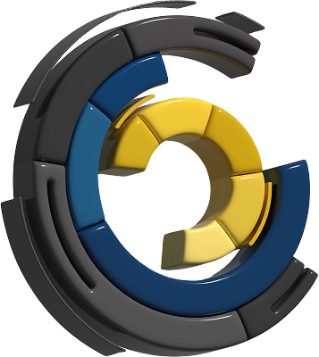

<h1> LSCS Headless Content Management System</h1>

---

## Table of Contents

1. [Development](#development)

- [Docker (Optional)](#docker-optional)

2. [Collections](#collections)

- [Default Collections](#default-collections)
  - [Users (Authentication)](#users-authentication)
  - [Media](#media)

3. [REST Endpoints](#rest-endpoints)

- [Autogenerated REST Endpoints](#autogenerated-rest-endpoints)

### Development

1. First [clone the repo](#clone) if you have not done so already
2. `cd my-project && cp .env.example .env` to copy the example environment variables. You'll need to add the `MONGODB_URI` from your Cloud project to your `.env` if you want to use S3 storage and the MongoDB database that was created for you.

3. `pnpm install && pnpm dev` to install dependencies and start the dev server
4. open `http://localhost:3000` to open the app in your browser

That's it! Changes made in `./src` will be reflected in your app. Follow the on-screen instructions to login and create your first admin user. Then check out [Production](#production) once you're ready to build and serve your app, and [Deployment](#deployment) when you're ready to go live.

#### Docker (Optional)

If you prefer to use Docker for local development instead of a local MongoDB or PostgreSQL instance, the provided docker-compose.yml file can be used.

To do so, follow these steps:

- Modify the `DATABASE_URI` in your `.env` file to URI of your selected DB
- Modify the `docker-compose.yml` file's `DATABASE_URI` to match the above `<dbname>`
- Run `docker-compose up` to start the database, optionally pass `-d` to run in the background.

---

### Collections

Collections are the defined entities of your CMS. See the [Collections](https://payloadcms.com/docs/configuration/collections) docs for details on how to extend this functionality.

### Default Collections

- #### Users (Authentication)

  Users are auth-enabled collections that have access to the admin panel.

  For additional help, see the official [Auth Example](https://github.com/payloadcms/payload/tree/main/examples/auth) or the [Authentication](https://payloadcms.com/docs/authentication/overview#authentication-overview) docs.

- #### Media

  This is the uploads enabled collection. It features pre-configured sizes, focal point and manual resizing to help you manage your pictures.

---

### REST Endpoints

Payload automatically configures REST endpoints for the defined collections

For example the User Collection will have the
`/api/users` for the GET request of all users
and `/api/users/[id]` will query specific users based on the id.

#### Autogenerated REST Endpoints

Payload CMS automatically generates RESTful API endpoints for each collection you define. These endpoints allow you to interact with your data using standard HTTP methods such as GET, POST, PUT, and DELETE.

**How it works:**

- Each collection (e.g., Users, Media, Posts) gets its own set of endpoints under `/api/<collection-slug>`.
- You can perform CRUD operations (Create, Read, Update, Delete) on your collections via these endpoints.
- Authentication and access control are handled automatically for protected collections.

**Examples:**

- `GET /api/users` — Retrieve a list of all users
- `GET /api/users/[id]` — Retrieve a specific user by their unique ID
- `POST /api/users` — Create a new user (requires appropriate permissions)
- `PUT /api/users/[id]` — Update an existing user
- `DELETE /api/users/[id]` — Delete a user

You can use similar endpoints for other collections, such as Media or Posts:

- `GET /api/media` — List all media files
- `GET /api/posts` — List all posts

For more details, see the [Payload REST API documentation](https://payloadcms.com/docs/rest-api/overview).

**Custom Endpoints**

API Endpoints with custom business logic needs to be implemented manually. Contact the development team for your request to be accomodated.
